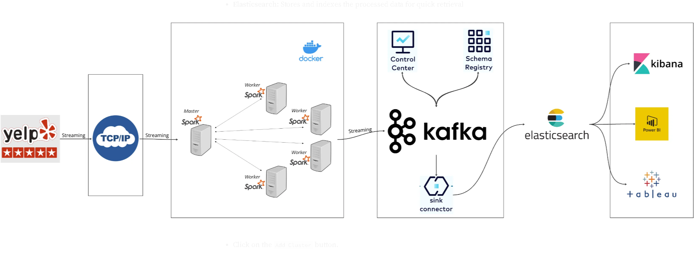

# Real-time-streaming-pipeline
End to end streaming pipieline with sockets, Spark, OpenAI, Kafka and Elasticsearch

Welcome to the Real-Time Streaming Pipeline repository! This repository demonstrates how to set up an end-to-end real-time data pipeline that ingests customer reviews, performs sentiment analysis using OpenAI, and stores the results in Elasticsearch for querying and visualization.

## Project Overview

This project is built to simulate real-time customer review ingestion, processing, and sentiment analysis using the following stack:

* Sockets for live data ingestion.
* Apache Kafka as the messaging broker to handle the real-time data streams.
* Apache Spark for processing the incoming data streams.
* OpenAI API for sentiment analysis of customer reviews.
* Elasticsearch for indexing and storing the processed data for querying and visualization with Kibana.

The primary goal of this project is to demonstrate how to build a scalable, real-time data processing pipeline that can be used in scenarios such as live sentiment analysis, customer feedback monitoring, and more.

### [1-Setting up the stack](./1-setup/README.md)

### [2-Configuration and Docker Files](./2-config-docker/README.md)

### [3-Streaming Data with Sockets](./3-sockets/README.md)

### [4-Streaming Data into Kafka with Pyspark](./4-kafka/README.md)

### [5-Streaming Data to Elasticsearch](./5-elasticsearch/README.md)

### [6-Querying and Visualization](./6-querying-vis/README.md)

## Architecture Overview

* Data Ingestion: Simulates live customer reviews using sockets.
* Data Processing: Spark consumes the data stream from the socket, applies sentiment analysis using OpenAI, and streams the processed data to Kafka.
* Message Streaming: Kafka manages the real-time flow of data to Elasticsearch.
* Data Storage and Visualization: Elasticsearch stores the processed data and makes it available for real-time querying and visualization in Kibana.

## Features

* Real-time data ingestion and processing.
* Sentiment analysis using OpenAI's API.
* Stream processing with Apache Spark.
* Scalable message streaming with Apache Kafka.
* Indexed storage and real-time querying with Elasticsearch.
* Visualize trends with Kibana dashboards.


## Project Structure

```plaintext

├── config                     # Configuration files for Kafka, OpenAI, etc.
│   └── config.py
├── datasets                   # Sample datasets, including the Yelp reviews dataset.
├── docker-compose.yml          # Docker Compose setup for multi-container services.
├── Dockerfile.spark            # Dockerfile to create a Spark environment.
├── src
│   ├── kafka-producer          # Scripts to produce data streams to Kafka.
│   ├── spark-streaming         # Spark scripts to process the data.
│   ├── elasticsearch-indexing  # Indexing scripts for Elasticsearch.
│   ├── openai-sentiment        # Scripts for sentiment analysis using OpenAI.
├── schemas                    # Avro schemas for Kafka topics.
└── README.md                  # You're here!

```

## Technologies Used

* Apache Kafka: Used for managing real-time data streams.
* Apache Spark: Processes the live stream of customer reviews.
* OpenAI GPT-3.5: Provides sentiment analysis for each review.
* Elasticsearch: Stores and indexes processed data for real-time retrieval.
* Kibana: Visualizes the results and trends in the sentiment analysis.

## Installation

### Prerequisites

* Docker and Docker Compose installed on your machine.
* API keys for OpenAI and Confluent Cloud (for Kafka and Schema Registry).
* An Elastic Cloud account for Elasticsearch (or self-hosted Elasticsearch).

### Steps

1. Clone the repository:
```bash
    git clone https://github.com/miladtajvidi/real-time-streaming-pipeline.git
    cd real-time-streaming-pipeline
```
2. Set up your environment:<br>
Update the config/config.py file with your API keys and connection details:
* Kafka cluster details
* Schema Registry credentials
* OpenAI API key
* Elasticsearch cluster details

3. Build and run the Docker containers:<br>
Use Docker Compose to start up the containers for Kafka, Spark, and Elasticsearch.
```bash
   docker-compose up --build
```
4. Start the socket producer:<br>
Start the script that simulates live customer reviews being streamed over a socket.
```bash
    python3 src/kafka-producer/streaming-socket.py
```
5. Start the Spark streaming job:<br>
Run the Spark job to consume data from the socket, perform sentiment analysis, and send it to Kafka.
```bash
    docker exec -it spark-master spark-submit --master spark://spark-master:7077 jobs/spark-streaming.py

```

6. Query and visualize in Elasticsearch:<br>
After the data is processed and indexed in Elasticsearch, use Kibana to visualize the sentiment trends.


## Future Improvements

* Implement rate-limiting and caching for API calls to OpenAI to optimize performance.
* Enhance security by integrating OAuth and SSL across all services.
* Add fault-tolerant mechanisms for handling service outages.
* Deploy the project on AWS/GCP for scalable and distributed workloads.
